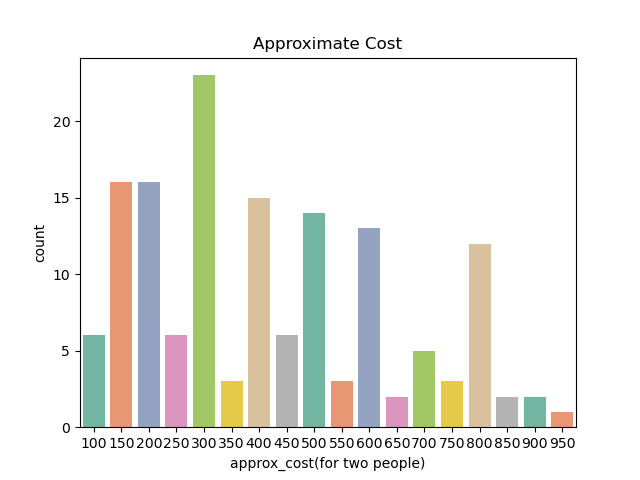
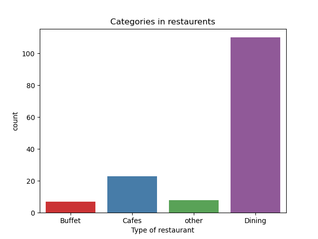
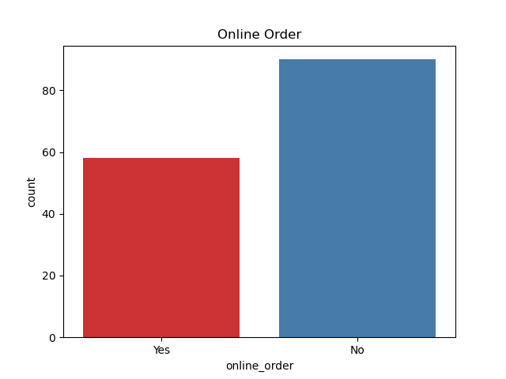
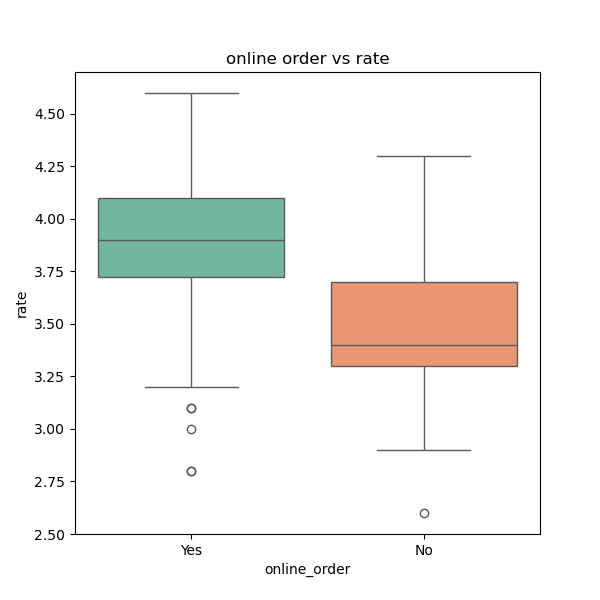
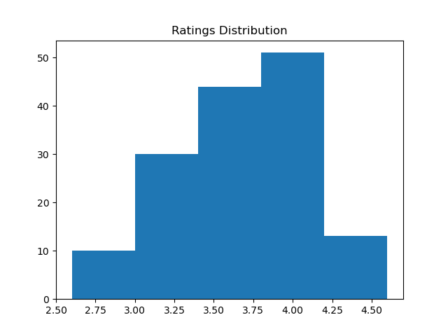
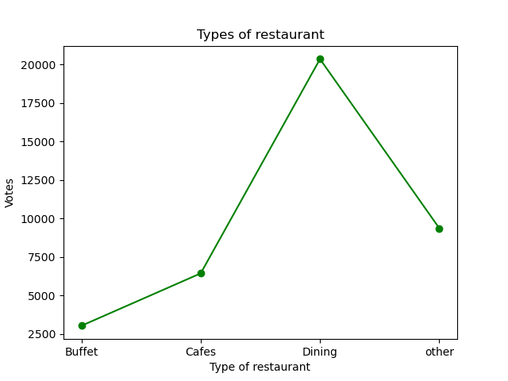

# 🍴 Zomato Restaurant Data Analysis

This project analyzes restaurant data from **Zomato**, focusing on customer ratings, online order availability, restaurant types, and approximate costs. The goal is to uncover insights into restaurant trends and customer preferences.  

## 📂 Project Structure  

```
├── Zomato-data-.csv              # Dataset
├── Untitled.ipynb                # Jupyter Notebook (Analysis & Visualizations)
├── approx_cost.png               # Approximate cost distribution
├── Categories_in_restaurents.png # Categories of restaurants
├── online_order.png              # Online order availability
├── Online_order_vs_Listed_In(Types)_heatmap.png # Online order vs restaurant type
├── online_order_vs_rate_boxplot.png # Ratings vs Online order
├── Ratings_Distribution.png      # Ratings histogram
├── Type_of_restaurant.png        # Votes by restaurant type
└── README.md                     # Project documentation
```

## 📊 Visualizations  

### 1. Approximate Cost  
  
Most restaurants charge around **300–400 INR** for two people.  

### 2. Categories in Restaurants  
  
**Dining** restaurants dominate compared to Cafes, Buffets, and others.  

### 3. Online Order Availability  
  
Many restaurants **don’t provide online orders**, but a significant portion does.  

### 4. Online Order vs Restaurant Type (Heatmap)  
_heatmap.png)  
Dining restaurants have the **highest offline presence**, while Cafes show a stronger online presence.  

### 5. Online Order vs Rating (Boxplot)  
  
Restaurants offering **online orders tend to have slightly higher ratings**.  

### 6. Ratings Distribution  
  
Most ratings lie between **3.5 to 4.2**, showing customer satisfaction is generally good.  

### 7. Types of Restaurants by Votes  
  
Dining restaurants receive the **highest number of votes**, showing higher customer engagement.  

## 🚀 How to Run  

1. Clone this repository:  
   ```bash
   git clone https://github.com/your-username/zomato-analysis.git
   cd zomato-analysis
   ```
2. Install dependencies (preferably inside a virtual environment):  
   ```bash
   pip install -r requirements.txt
   ```
3. Open the Jupyter Notebook:  
   ```bash
   jupyter notebook Untitled.ipynb
   ```

## 🛠️ Technologies Used  
- **Python (Pandas, Numpy, Matplotlib, Seaborn)**  
- **Jupyter Notebook**  
- **CSV Dataset**  

## 📌 Insights  
- Dining restaurants dominate Zomato listings.  
- Online orders are associated with **better customer ratings**.  
- Most restaurants fall in the **affordable price range** (300–400 INR).  
